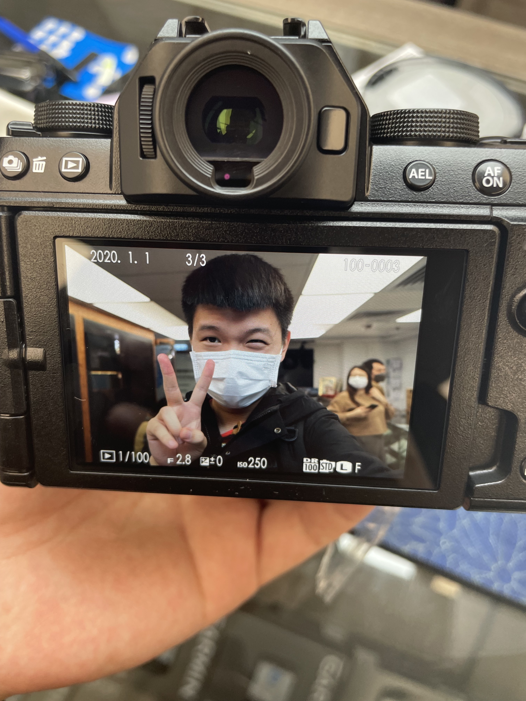

# To 刘睿：

对我来说 这梦幻般的几天终于迎来了他的结尾 很多见面没能说出口的话以及来不及和你娓娓道来的话 我想通过这种方式传达给你。

**时光流逝 明明还没能和你多度过几段可以用“青春”这两个词作为借口的时光 转眼我也慢慢要成为一个大人了 不知道现在这样的习惯的 不用负责任的相处方式 这样简单的 无需太多要求的相处方式 还能持续多久.**

大概很多东西都是如此 找到了一个借口 仿佛就能暂时忽略所有的不确定与不足 让人能够麻痹一段时间 不去思考许多意识得到的困难

其实我也是一样 因为害怕一些事 所以选择不去想他们 因为担心一些事 所以总是去逃避 到头来 就像很多事也没想象中那么美好一样 其实很多事也没有那么美好

说到美好 其实我认为这个世界上能够让人称之为美好的事物不多 当然 每个人有每个人认为的不同的美好 可能是回不去的被拆迁的故居或者好吃的面馆 可能是曾经待过一段时光就再也没回去过的地方 也甚至是在当时觉得度日如年 但是现在回想起来却十分温暖的时光（比如学校）。 在我看来 他们都有一个比较明显的共同点 那就是**都回不去了或者不在了** 这样也许很残酷 但这可能就是无可避免的痛。也正是因为美好的特殊性 所以美好对于每个人基本是公平的 每个人觉得美好的事物 或者过去有遗憾的事物
是相对稳定的 可能在别人眼里看来很普通的事物 在某对人或者某个人眼里就是十分温暖的存在 所以我认为这是非常难得的。 

**今后我想我们也会伴随着喜怒哀乐 伴随着悲欢离合活下去 也许在我们痛苦的要放弃一些东西的时候 我们也能去收获那无可替代的事物 也希望那些伤疤 伴随着那些美好 能成为永不消退的痕迹 因为就算过上几十年 我们也肯定不会忘记。**

睿，也许现在看来 我们之间的未来充满不确定性 事实也是如此 可能我也不能完全太理解大人们认为的很多事情 也许再过上几年 我会慢慢理解 接受，并与以前的那个幼稚的自己和解 让这些美好的回忆 我们在一起的时光成为一道疤痕 成为我生命中最美好的一部分。又也许我能尝试不理解 去迎接万难 让你能够成为我生命中的一部分 这么一想 前面那种结果也就没那么坏了：）

**记住我们原本的样子 就是我们能留给彼此的最佳礼物** 刚和你认识时的第一封信的结尾 也是这句话 我认为放在这也有更加深刻的不同的含义 几乎是无可避免的 每个人都会慢慢变化 不论是好是坏 我们都得承认很难回到过去这一事实 如果在漫长的人生中能够相识相知相爱并能最后走到最后 我认为是非常非常幸运的 这样的情况 看似每天都在发生 但其实真正属于这种情况的还是少数 我不会说给我一点时间这种自己都半信半疑的废话 我只会努力让自己不成为你的束缚
同时尽我所能给你带来幸福。我认为这就是目前我能对你说的最漂亮的话。

宝 爱你的王哥

2022.5.2

