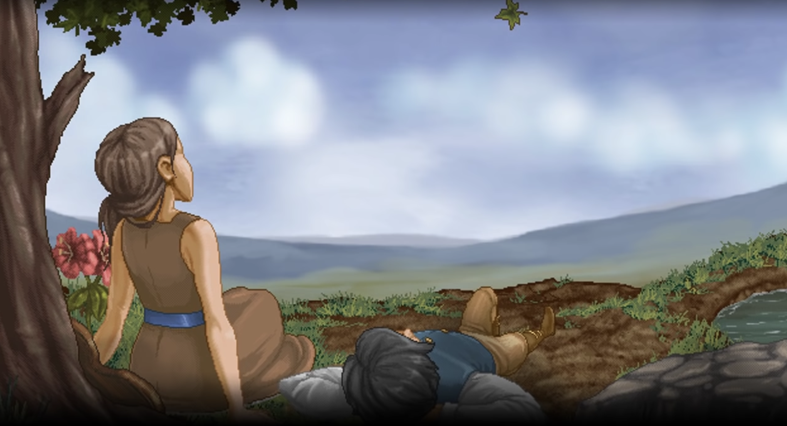

> **"Sure... If I go, you'll be alone at times you don't wanna be. But that's all a part of growing up, and it's all a part of life. It's what makes fleeting moments with loved ones special, and our memories treasured."**

**To. 刘睿:**

**键字如面**，如果你对这个页面有些疑惑，也许你会想起一个月前我说过每个月会给你写一些东西，这不能称之为信，也许是一些感谢，一些一个人的时候对自己说的话，一些杂杂碎碎的这段时间的经历... 不管是什么 我希望看到这些字的你一切都好，也期望你能看到最后。

最近一个月，隔三差五就会梦到一些事，不知道是不是因为睡了太久的缘故，比如说今天，五一节，我睡到了晚上七点多，其实下午两三点醒来过一次，甚至还打开了手机和爸妈视频，但是挂完又接着睡了，原因也许是想把那个梦继续做下去，果不其然，一下就睡着了，也一下就回到了那个梦里。在梦中我回到了家，不仅是身体回到了家，也仿佛年龄也回到了我们都还是未成年人的年纪。我梦见了很多熟悉的地方以及熟悉的人，臭豆腐店，小学的校门口，甚至早已被推平的小时候玩过的山丘，当然还有你。这些好像都已经离我远去，所以能在梦里见到这些，抱着不是多睡一下而是想继续体验这些梦的想法重回被窝，是一件再正常不过的事。

其实我很抱歉之前发生的一些事，但之前自己一直都没有想清楚 所以没和你提及过，我不知道你是因为哪件事还是哪些事之后决定离开，我的处理方式确实非常糟糕，也许你不太喜欢我这种“想得过多的性格”，或者说 你认为的“想得过多的性格”，但对我来说，无论你是否相信，想得很多其实是一种简单的体现，我觉得对你 我一直都是希望你能明白我的内心的想法，我一直把你当作的是最好的朋友，唯一的喜欢的人来对待，这两者能重合，可能和你在一起的前5年没有意识到，但最后这一年多，尤其是前年开始的一些日子，我是一直感觉自己是幸运的，是被保佑的人。虽然我们经常会吵架，虽然有时候真的我会觉得你很烦，想挂视频，不想再联系，但往往二十分钟之后，我就不会生气了，一般来说比你好的时间更快。以前我也不是这样的，不知道是不是受你影响 还是因为你是特别的人呢？但时间会冲淡很多事，写点啥的意义也就在于此，希望能用这些文字来记录自己此时此刻的想法，这就足够了。

在这一个月的时间里，偶尔会想着给你发点什么消息，但考虑到很多的原因，每次都作罢，（主要每次开始动笔，写什么成了一个非常大的问题）。但是吧，有的时候也还是很想你，会想起一些过去的日子，在我眼中都是一些美好的回忆。比如昨天看到五一节旅游在广州有人爬到圣心大教堂门前的石碑上，然后石碑倒了，我就想起我们第一次在广州玩的日子，一般遇到类似的情况，我脸上都会带着笑，但你放心，我说这些没有想要让你回来的意思，如果你现在过得很好，我祝福你，如果你有任何需要帮助的，打我的电话，我尽我所能去提供协助。我也知道你说的你可能没我想象中那么完美的意思，每个人都知道最真实的自己是什么样的，也都会有很多不想让别人知道的秘密，年龄越大越是如此，秘密也会变得越来越可怕。但在我眼中这些都不重要，我只是很感激与你在一起的这几年的回忆，尤其是你的陪伴，虽然可能在你看来没有什么自豪的，但是你让我成为了今天的我，你不能教给我我不知道的东西，也不能让我做我不想做的事，我真正想要的是你的陪伴，是每天即使你不在身边，但想到你的样子，想到你还在我‘身边’，内心的安心感，可能我想要的太多了，太怕你离开了，你会觉得有些不自在，甚至会有些讨厌，会感觉看不透我是一个怎样的人。也许也是因为我和你在一起的时间太长了，我承认你很迷人，但有时候，走出我们为自己创造的小小世界，是唯一能够让我发现并欣赏周围美好事物的方式。

刚才我说是你让我成为了今天的我，可能在你看来有些些说笑，因为我现在好像也没什么了不起的地方，也许过几年再回头看，如果咱们还有机会见面的话，你会主动告诉我你明白这句话啥意思了。我印象很深的一件事，大概两个月前的一个晚上，那时我刚从公司楼上下来，想着给你打个电话，然后我们聊了一下，你说我没有梦想，觉得这样就够了，觉得上班，拿一点钱这就够了，为什么不去创业？我当时的回答是创业比想象中的要难得多，记得两年前在广州的时候你也问过我同样的问题，你问我为什么不去创业，像你父亲一样，挣第一桶金。我当时说哪有这么容易，然后啪啪啪给你举了好多个例子，满口都是什么“潜规则” “关系” “时代”。其实现在回头想起来，很多时候是我自己太过于自负，觉得自己什么都理解，反而忘记了很多自己以前的梦想，很多时候还没尝试过就一边抱怨一边放弃，就算我当时所说的现象是实话，这也不应该成为自己在这个年纪因为想放弃而说出的话，只有努力过 拼到最后 哪怕最后一无所获 这时候才能充满自豪的选择放弃。我所定义的成功也不是成为“人上人”，我也只是想能够有办法获得“内心的平静”。大家每个人都是一棵树，就算最近的距离也只是两棵树的距离，不可能做到完全的相互理解，当大风暴来临的时候，我们要么随风摇摆，要么奋力抵抗直至连根拔起。有些树想比周围的树都高，有些树想让鸟儿们能够栖息，有些树想细细的感受来自世界各地的风，有些树想为周围的树遮风挡雨...... 我不希望自己变成那种轻易放弃，对自己的梦想无所谓甚至忘记的人。在时代的浪潮中，我也会想只靠自己骄傲的活下去。

来说说我自己吧，我还是和以前一样，完全不确定自己未来要做什么，甚至连下一步去哪都没确定，你可以说是迷茫，也可以说是目前没有一条路是自己内心真正想去做的，无论是读研也好还是继续工作也好。总觉得自己能力还不足以支持做我自己想做的事，有太多需要去学的了，但同时面临着一些世俗的欲望的烦恼，比如金钱与梦想的抉择，朋友的眼光，家人的支持...... 总之发觉到自己有许多的事需要考虑，不能再像以前那样不顾一切的做一些想做的事了。但可以明确的是在有限的未来三年，我会继续呆在香港，和我的梦想一起慢慢老去，工作也好读书也好，都不会影响我对于梦想的追求。而这个梦想其实也很简单，就是获得内心的平静。这应该是我第一次和别人说这些：“我是一个不太聪明，但理解能力却意外的还行的人，或者说我回去试图探究，理解我所感兴趣的每一件事背后的含义，原理，所以在学习一件事的时候，我会经常自然的去想去试图理解背后的发生了什么，比如说现在在学的计算机，我们平时会用各种各样的编程语言，那我就会想着说编程语言是怎么实现的？甚至我会去做一个自己的编程语言出来，当我理解这些之后，我再用这些东西的时候，我会更加得心应手，同时获得‘内心的平静’“。这听起来有些奇怪，但这就是我，我不以说出这些为耻，反而很开心你能看到这些。我试图去理解我所见证到的感兴趣的事，这就是我说的梦想，对我来说这很难做到，也许在可以预见的将来，为了做到这些我可以花上大把的时间，也可以让自己不去在乎他人的眼光。但我真的不希望伤害到别人，尤其是为了自己一些欲望，利益去伤害别人。我不希望做这些事，无论主动或者被动。

也许是我确实做了一些不太正确的事，我不能将这些都归咎于不成熟，比如说和创宇那次，我失去了一位真挚的朋友，因为我的逃避。从那次以后，你可以说我长大了许多，也更加懂得与人相处之道，但好像也变得不太容易与人亲近，我讨厌这样。我也一次次的怀念那个大家没有什么算计，就算有也只是有恶作剧式的算计，不会有坏心思的算计的时候。在长大的过程中，我是否也会成为那样的人呢？或者说，我是否也需要成为那样的人呢？

刘睿，如果我没和你说过抱歉，那么在这里我想好好的给你道一个歉，虽然没有什么意义，你说的对，如果我好好经营一段感情，而不那么想着我自己，也许很多事不会那么快发生，或者就根本不会发生，但很多地方我做错了，我没有让你感受到我对你的爱，让你非常的沮丧和难过，这段时间我有时候又会犯我的老毛病：回想过去，发觉真的有很多事是我自己做的太差了，然后处理的方式也非常不理性，我当时轻率的认为这就是我的性格特点，甚至这就是我让人喜欢的地方，所以更加的没有去改正这些，我只希望你知道当时的我并没有恶意，最多只是故意，我为我的不成熟而向你道歉。对不起。

好像有很久很久了，上一次抱着草莓熊的时候是什么时候，不太记得了，只记得真的很久很久了，昨天晚上七点从梦里醒来，感觉到自己压到了什么东西，翻过来发现是草莓熊，突然有一种失去了什么的感觉，怅然若失？我还记得曾经抱着他的时候的感觉，好像他是真的活着一样，和他说的话他都能理解，然后给我擦眼泪一样，现在每次晚上爬上上铺，直接睡觉的时间居多，就算能够想起他的时候，也感觉仿佛他失去了生命一般，我不知道该用什么语言表达，也不知道他是否代表着我心中的某一部分，我只知道在打下这些字的时候泪水还是出来了，很多时候只是我们不愿承认，欺骗自己罢了，在刚成为大人的时候，大家都会做一些错误的事，承担做这些事的后果，从中吸取教训，然后继续向前，我觉得没什么大不了的，最重要的是那些因为这些事而失去的东西，却永远的留在了过去，再也回不来了。

讲点开心的，首先祝贺你成功申上了研究生！我觉得如何选择还是看你自己的想法，其实和专业没有什么关系，不必过分担心专业的问题，出来之后没人会在意你的专业，他们只会看你的学校，也不会有什么难学的，这点不用担心，关键是看你追求的是什么，和你打算如何度过这一年的时光，如果你追求的是学历的证明，那张纸，那么排名更高的是更加好的选择，如果你选择的是换一种生活方式，那么就看哪个地方更让你舒服，你更想去哪。如果你考虑的是未来的生活，那么你就得去那个更能让你获得向往的生活的地方，如果你追求的是梦想，那你就得去思考你的梦想以及哪里才能更好的实现它...... 如果这些都没有一个标准的答案，你可能就要去问问你自己，哪里让你的感觉最好？或者请教一下身边长辈的意见，总之 多多去纠结 去烦恼，这不是一件坏事。

愿一切顺利，如果有什么我能帮上忙的，无论什么都可以和我说，最好打电话给我，消息不一定能够及时看得到。

W

